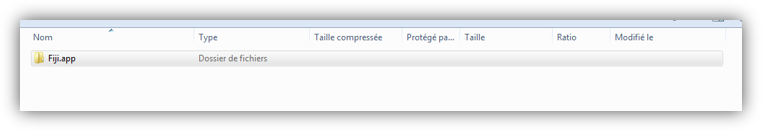

# Install

## Fiji Install

After downloading the **zip of fiji** of your operating system, **unzip it** And you will have folder fiji.app (For MacOS unzip in Applications) :

Start ImageJ executable :

## Install Our Plugin

- In Fiji go to **help** and **Update**

- Click on **Manage Update Site**

- Select **PET-CT** and **Nuclear Medicine** and click **Close**

- You will be asked to restart Fiji, and then you're ready !

