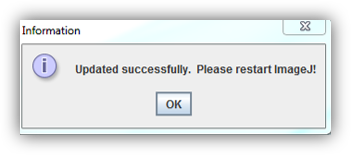

# Updating

Fiji automatically looks for update at startup (if your computer is connected to the Internet).

When an update is available, you will have an update request, simply Select
on “Yes please” and click “OK”

A second box will show all files that will be updated, simply confirm by clicking “Apply changes”

Click at **Apply changes**, and restart Fiji:

