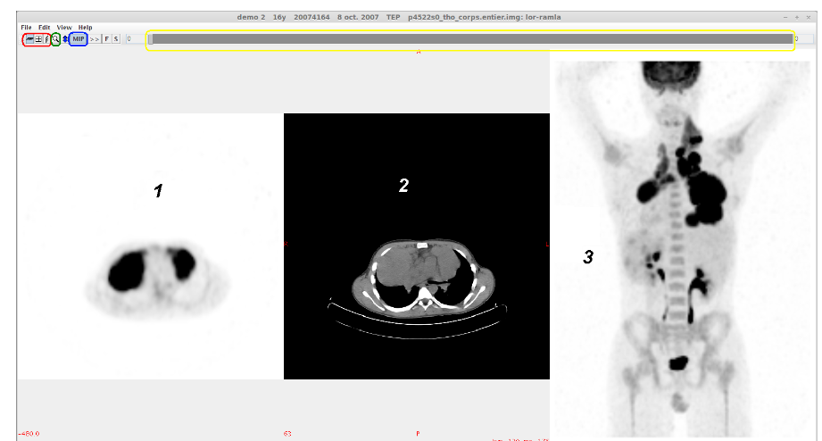

# Main View

- Buttons (on the top): 
    - Axial, coronal or sagital view axis (red)
    - Zoom (green)
    - Disable or Enable MIP (blue) ; if disabled PET-CT fusion will be shown
    - Windowing (yellow) : you can change the center and the weight of the window throughthis bar

- Area : 
    - 1 : PET slices. By right clicking you can change the look up table
    - 2 : CT slices. By right clicking you can switch between pre-defined windowing
    - 3 : MIP of PET-CT fusion (depending if MIP is displayed or not)
