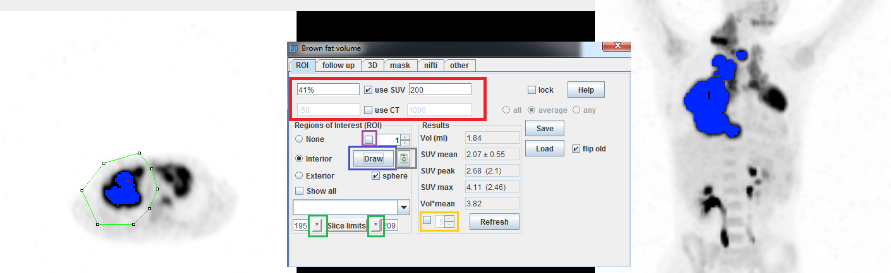

# TMTV Calculation

- Go to **Edit** menu and **Brown Fat, ROIs**

- To set your calculation parameters use the 4 first white boxes (red) :
    - You can set an SUV condition : The left box is for the lower limit and the right box isfor the upper limit.
        - For TMTV, usually we don't need an upper limit so you can set it to a very high value (500) to be sure to include all high uptake voxels
        - In the left box you can use a fixed cut-off (for example : 2.5) or a SUVmax thresold (you just need to add % to do so, for example you can type 41% for 41% of SUVmax)

    - You can also set a CT condition but it might be useless for TMTV calculation, if youdon't need it just unselect “use CT”

- To Draw the ROI use the "Draw" button on the left bottom panel (blue), and click on the image to draw your ROI. 
    - Double click to close the ROI when drawing. 
    - Once your ROIshape is defined you have to expend in on other slices to get the third dimension.You will notice two “*” buttons at the bottom (green), in the image go to the first slice you want to expend your ROI to and hit the first “*” than go to the last slice you wantand  hit the other “*”. Your VOI is defined. 
    - If you click on the little box near the ROI number (purple) the display will automaticallybe updated to show the ROI position when you review your previous ROIs using up and down buttons.

- To erase a ROI, simply use the trash icon (gray)

- To visually control the calculated MTV, activate the checkbox on the bottom right(yellow) and increase the number in the box to show selected voxels in blue. If enabled,the MIP will also include the blue dots. Lastly, you can right click on the PET image and use “3-PET” to check your calculation in a 3 axis way

- The save button allows you to save all your results and ROI positions on a CSV file. You can load the saved ROIs using the load file (the generated CSV contains both resultsand ROI coordinates).
