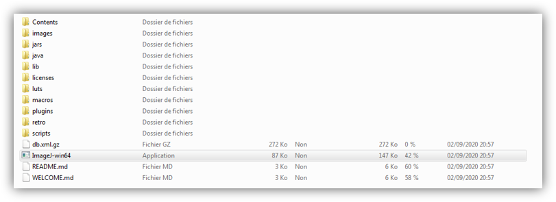

You have just donwloaded the **zip of fiji** .

Then you can **unzip it** . And you will have folder fiji.app:

Click here to launch the app:

You may have this:

Then you need to follow page 2 of
    **[Advanced guide](../../static/img/BI_quick_user_guide1_2.pdf)**
to continue.

