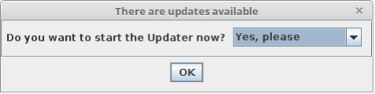
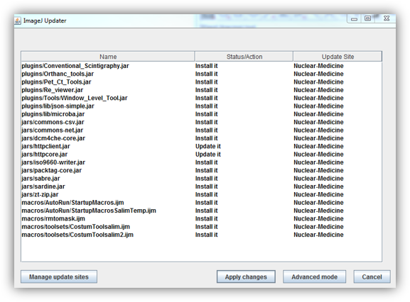
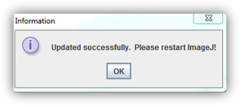
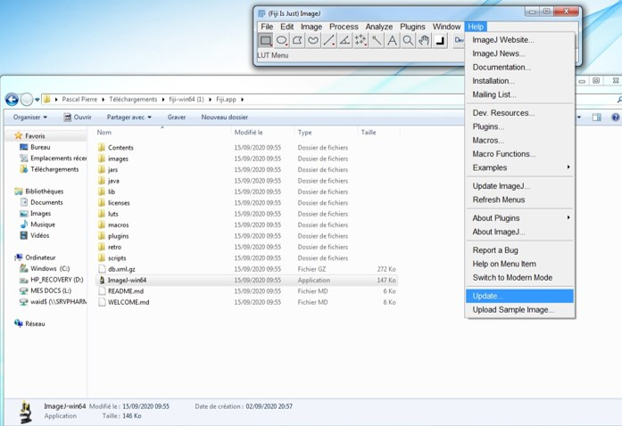

Fiji automatically looks for update at 
startup (if your computer is connected 
to the
Internet).

When an update is available, you will 
have an update request, simply Select 
on “Yes
please” and click “OK”

A second box will show all files that 
will be updated, simply confirm by 
clicking “Apply
changes”

Click at **Apply changes**, you will have:

## How to update by yourself

When the app launched, you can click **Update...** of **Help** in the menu

