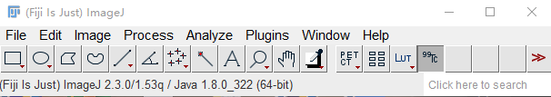
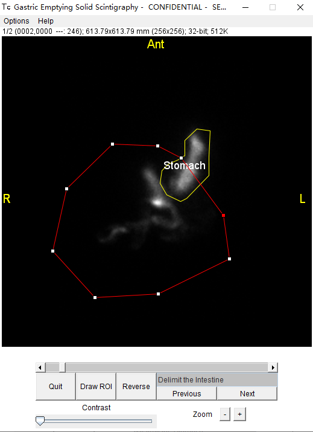
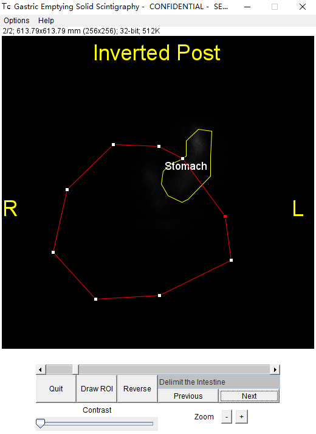
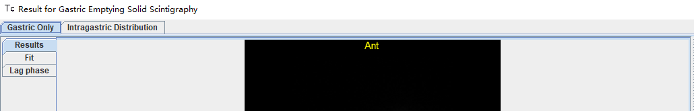
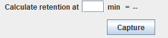
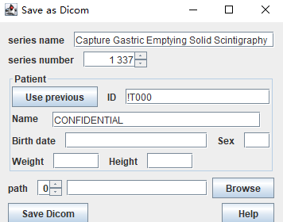

import Tabs from '@theme/Tabs';
import TabItem from '@theme/TabItem';

# Nuclear Medicine

### To begin the view of examination

Once the images are opened, **right-click 99Tc** in the bar.

Then select your processing software tool.

### Select exam type

 In this example we will select **Castric Emptying Solid**.

Then it will list all the images you read before.

<kbd class="key">Ctrl</kbd>
+
 Left Click  to select many images you want :

## An exemple (Gastric Emptying Solid) to show the process

Then you'll have some specific properties of the examination that the doctor need to 
fill. Then click at **Validate**.

### Delimit the range 

Left-click to delimit the range of stomach, right-click to close the range.

Click at **next** at bottom : 

Then delimit the range of intestine.

#### Repeated Steps

Click at **next** to ajust the range of stomach of a new image.

Click at next to ajust the range of intestine in of this image.

Repeat **the 2 steps above** until the range of all images are adjusted.

### Results

At top left you have two options to view the result.

Gastric only:

Intragastric distribution:

<!---

--->

You have the bouton **Capture** at bottom right to save the result.

