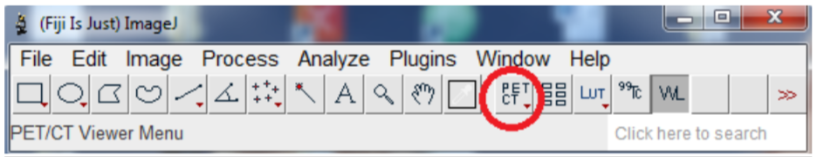

# PET-CT

Once our plugin installed, a PET/CT shortcut will be available

You can open your dicom and click this button to start the PET/CT viewer.

If you opened a CT + PT series using the DICOM reader, the PET/CT viewer will start automatically