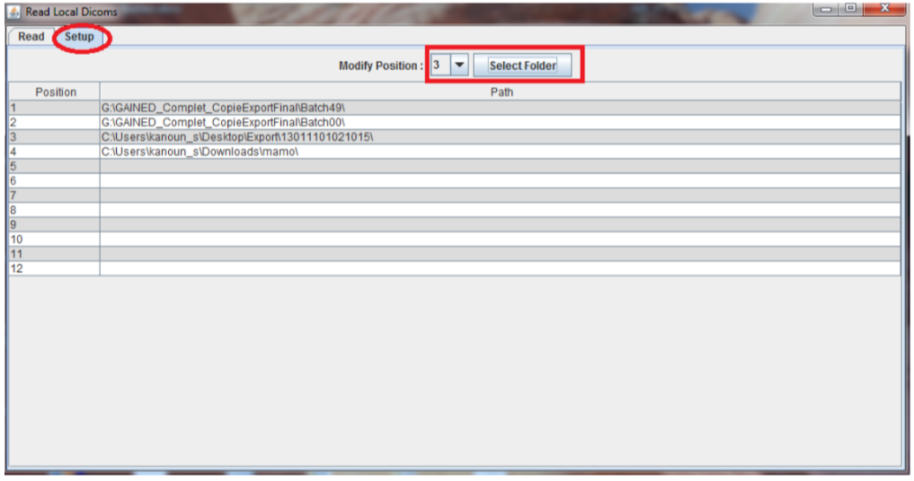
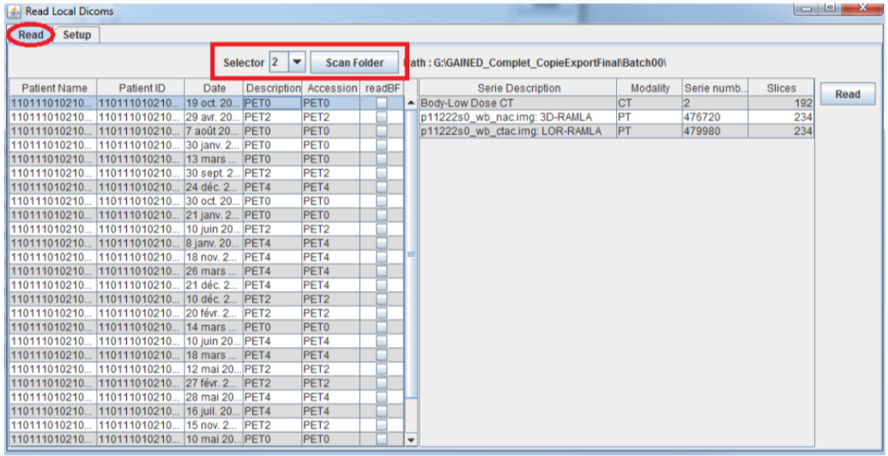

# Reading DICOM

## Local DICOM

A reading tool is provided to scan a dicom folder and list its DICOM Study/Series content.  
For performance reason we recommand to read from a high speed storage device such has SSD (avoid reading for CD or USB stick because of the high latency of these storages)

- Go to "Read Local Dicoms"
- In the setup tab select your folders containing DICOM images (up to 12 locations)

- In the read tab, select your location to be read and press **Scan Folder**
    - Left panel is showing studies (click to select)
    - Right panel shows the series of the selected study

- Select one or several series and press **Read** to open images in Fiji

Warning : Fiji does not support DICOM compressed syntax, consider transcoding your files (for instance using Orthanc) before opening it in Fiji.

## Reading from Orthanc

With the **Orthanc Tools** you can read images from an Orthanc Server

*Documentation in progress*