import Tabs from '@theme/Tabs';
import TabItem from '@theme/TabItem';

## To begin the view of examination

Once the images are opened,
you can right-click **99Tc** in the right  of the bar.

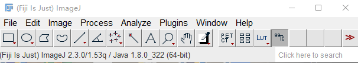

Then you can select your exam type.
<Tabs>
  <TabItem value="Generic" label="Generic">
    Dynamic Quantification
     
    Static Quantification
  </TabItem>
    <TabItem value="Bone" label="Bone">
    Bone Scintigraphy
  </TabItem>
    <TabItem value="Cardiac" label="Cardiac">
    Amylose
     
    MIBG Quant
  </TabItem>
    <TabItem value="Endocrinology" label="Endocrinology">
    Thyroid : Tc Uptake
     
    Parathyroid : Parathyroid
  </TabItem>
    <TabItem value="Gastric" label="Gastric">
    Gastric Emptying Solid
     
    Gastric Emptying Liquid
     
    Esophageal Transit
  </TabItem>
    <TabItem value="Lymphatic" label="Lymphatic">
    Lymphoscitigraphy
  </TabItem>
    <TabItem value="Pulmonary" label="Pulmonary">
    	Pulmonary Shunt
  </TabItem>
   <TabItem value="Renal" label="Renal">
     Renogram
     
      DMSA
     
      Renogram Follow-Up
  </TabItem>
    <TabItem value="Salyiary Glands" label="Salyiary Glands">
      Salyiary Glands
  </TabItem>
   <TabItem value="Others" label="Others">
     Schaefer Calibration
  </TabItem>
</Tabs>

## Select exam type

 In this example we will select **Castric Emptying Solid**.

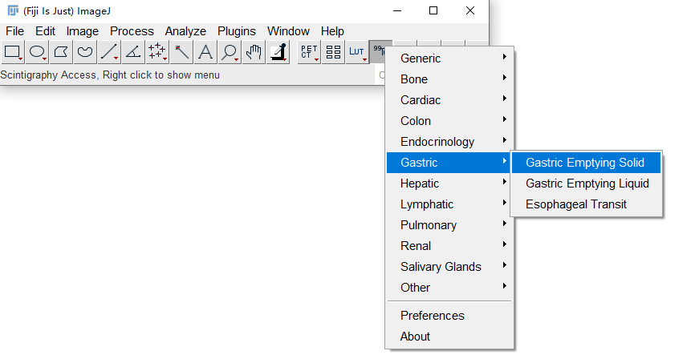

Then it will open all the images you read before.

Click  **Select All** of :

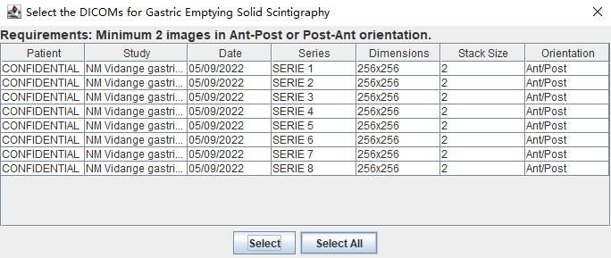

## Specific properties 

Then you'll have some specific properties of the examination that the doctor need to 
fill. Then click at **Validate**.

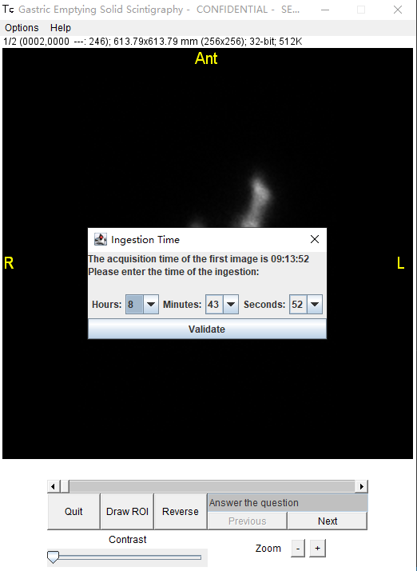

## Delimit the range 

Left-click to delimit the range of stomach, right-click to close the range.

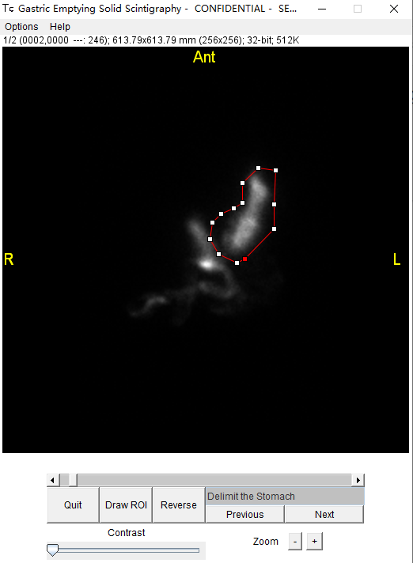

Click at next, then delimit the range of intestine.

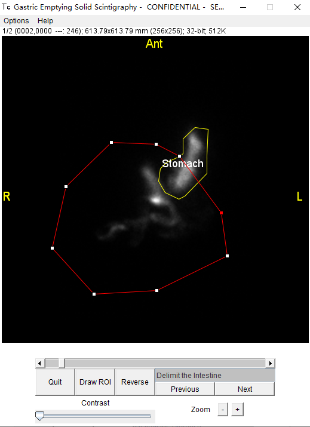

### Repeated Steps

Click at **next** to ajust the range of stomach of a new image.

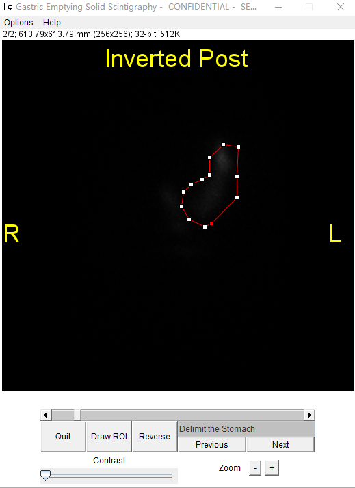

Click at next to ajust the range of intestine in of this image.

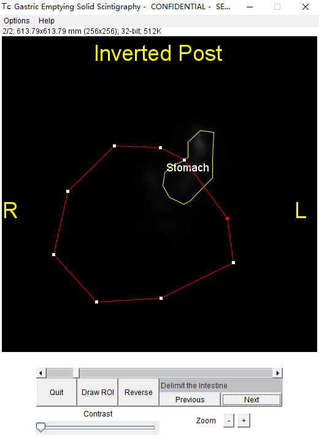

Repeat **the 2 steps above** until the range of all images are adjusted.

## Results

At top left you have two options to view the result.

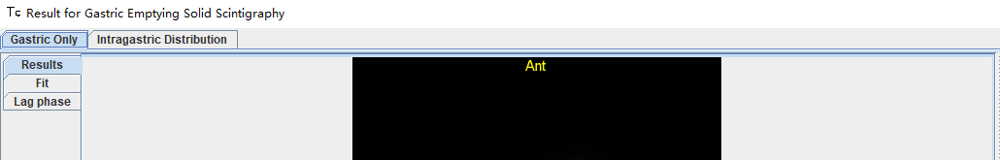

Gastric only:

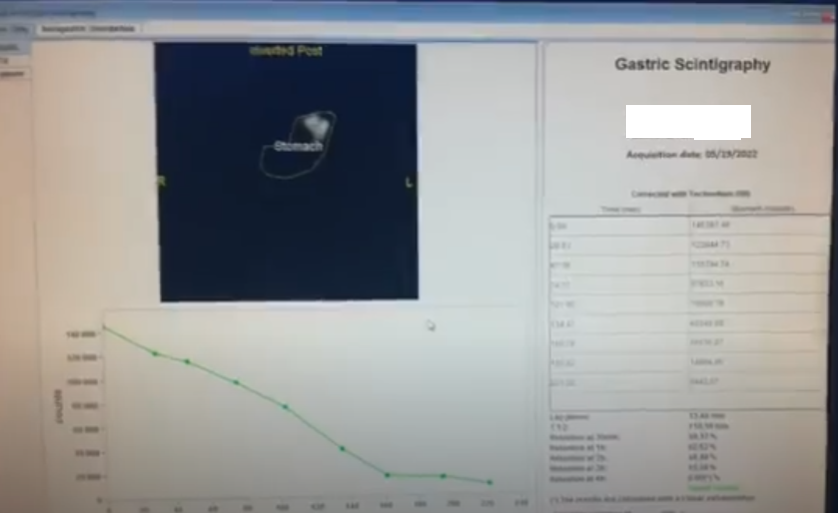

Intragastric distribution:

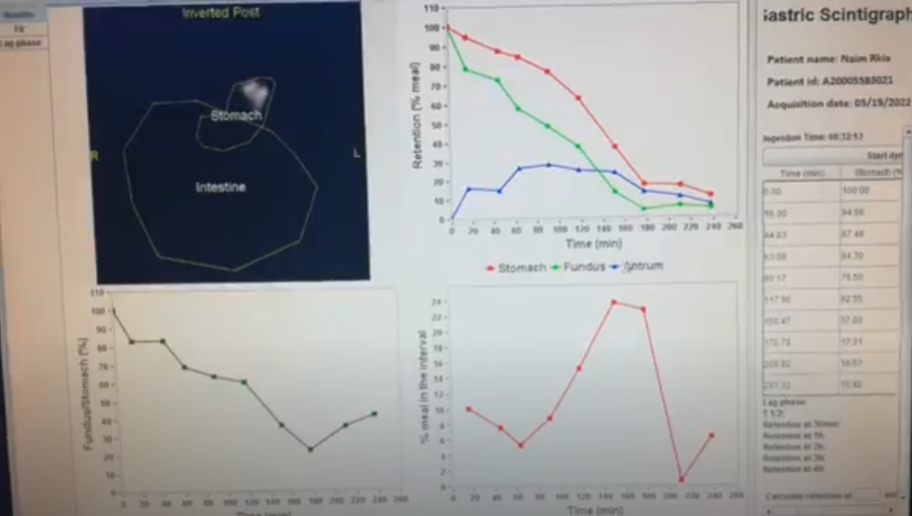

You have the bouton **Capture** at bottom right to save the result.

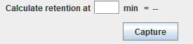

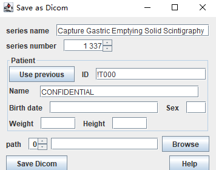
