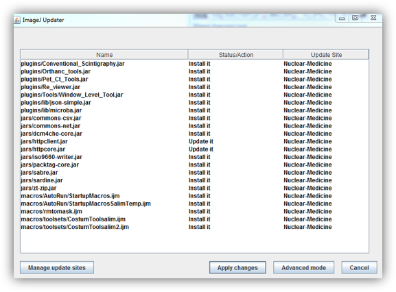
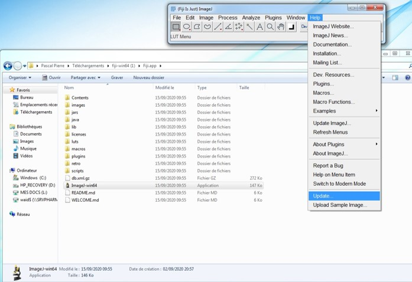

Normally, when you launch the app, it will demande you a update:

Click at **Apply changes**, you will have:

## How to update by yourself

When the app launched, you can click **Update...** of **Help** in the menu

