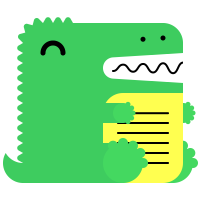

# Presentation Possibilité

## Titre de niveau 2

### Titre de niveau 3

#### Titre de niveau 4 ne son pas dans le menu

## Code
```jsx title="/src/components/HelloCodeTitle.js"
function HelloCodeTitle(props) {
  return <h1>Hello, {props.name}</h1>;
}
if (highlight) {
    // highlight-next-line
    return 'Ce texte est surligné !';
  }
```

## Note

### Note
:::note remarque

Un peu de **contenu** avec la `syntaxe` _markdown_. Consultez [cette `api`](#).

:::

### Tip

:::tip astuce

Un peu de **contenu** avec la `syntaxe` _markdown_. Consultez [cette `api`](#).

:::

### Info

:::info

Un peu de **contenu** avec la `syntaxe` _markdown_. Consultez [cette `api`](#).

:::

### Attention

:::caution attention

Un peu de **contenu** avec la `syntaxe` _markdown_. Consultez [cette `api`](#).

:::

### Danger

:::danger
Un peu de **contenu** avec la `syntaxe` _markdown_. Consultez [cette `api`](#).
:::

<!-- Prettier ne change pas ceci -->
:::note
Hello world
:::

import Tabs from '@theme/Tabs';

import TabItem from '@theme/TabItem';

:::tip Utiliser les onglets dans les admonitions

<Tabs>
  <TabItem value="apple" label="Apple">Ceci est une pomme 🍎</TabItem>
  <TabItem value="orange" label="Orange">Ceci est une orange 🍊</TabItem>
  <TabItem value="banana" label="Banana">Ceci est une banane 🍌</TabItem>
</Tabs>

:::

## Image


### .sgv



### Math

$$
I = \int_0^{2\pi} \sin(x)\,dx
$$